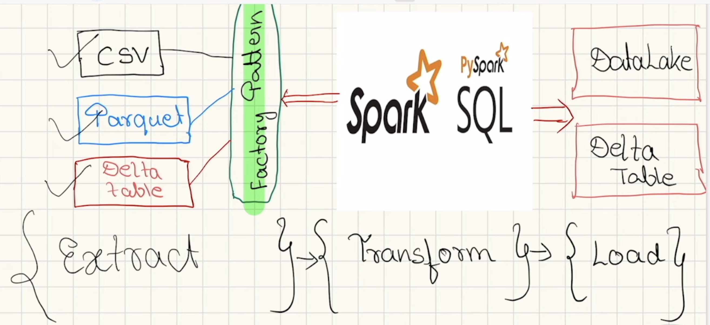

# Scalable ETL Pipelines for Apple Products Analysis with PySpark

- Created ETL pipelines for different use cases to analyze Apple products information using PySpark with sources such as **CSV**, **Parquet**, and **Delta Tables**.
- Implemented the **Factory Pattern** for designing reader classes to handle multiple data sources effectively.
- Applied PySpark's **DataFrame API** and **Spark SQL** for business transformation logic.
- Demonstrated data loading strategies for both **DataLake** and **Data LakeHouse** architectures.
- Explored and implemented PySpark concepts like:
  - **Broadcast joins**
  - **Partitioning and bucketing**
  - **Window functions** like `LAG` and `LEAD`
  - **Delta Table operations**

## Technologies Used

- **Apache Spark** (PySpark)
- **Databricks** for pipeline creation and storage (Community version)
- **Data sources**: CSV, Parquet, Delta Table
- **Storage**: DataLake and Data LakeHouse (Databricks)
